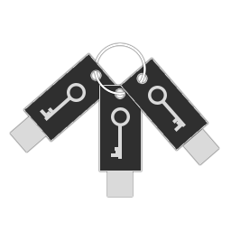

# dpGPG


d3s's Physical GPG - a toolchain for making physical gpg private key

## The idea:
You know that feel when you are working on your laptop in McDonald or whatever and you are reading mails from your friends who are into encryption, so they send you GPG-encrypted emails, and suddenly some guy tries to steal your laptop with your private GPG key? No? Me too.

Idea behind dpGPG is that you can work with your private GPG key only when there is connected special pendrive into one of USB the ports of your laptop/PC. Also you can work with your GPG-encrypted files on pendrive buffer so when you unplug the pendrive, there is no decrypted data on your laptop.

(If you want stable version of dpGPG, see "master" branch. Else you can find development files in "devel" branch.)

## Requirements:
### Hardware:
- Literally any GNU/Linux distribution which runs systemd-like daemons or something (idk im still learning)
- ANY pendrive/sdcard/whatever (can be even 8MB if you want only to store GPG key on it)
- Time for reading all this stuff made by some amateur (me lol)

### Software:
- g++

## Build:
Simply copy and paste these commands to clone latest stable branch and compile it:
```
git clone https://github.com/d3suu/dpGPG.git
cd dpGPG
chmod +x build.sh
./build.sh
```
Your binaries will be in ./bin directory.

If you want to download latest development version, simply copy these commands:
```
git clone -b devel https://github.com/d3suu/dpGPG.git
cd dpGPG
chmod +x build.sh
./build.sh
```

## Installation:
__TODO__

## Usage:
### dpGPG-pendrive-generator
If you're executing dpGPG-pendrive-generator without arguments, there will be information about usage:
```
d3s@hostname:~/dpGPG/bin$ ./dpGPG-pendrive-generator 
dpGPG pendrive generator by Mateusz d3s Dukat
./dpGPG <pendrive_device> <full_path_to_secring.gpg>
```

dpGPG-pendrive-generator as arguments takes pendrive device (*not partition!*) (eg. /dev/sdg, not /dev/sdg1) and full path to your secring.gpg file (eg. /home/d3s/.gnupg/secring.gpg).

Standard output should look something like this:
```
d3s@hostname:~/dpGPG/bin$ sudo ./dpGPG-pendrive-generator /dev/sdg /home/d3s/.gnupg/secring.gpg 
Generating MBR and partition table...
Putting generated MBR on drive...
Syncing drives...
Formatting and mounting 1MB partition...
mkfs.fat 3.0.28 (2015-05-16)
Putting secring.gpg on pendrive...
Clearing stuff...
Work done. Have a nice day :P
```

With that done, your pendrive should be partitioned and formatted with everything done.

#### Errors:
dpGPG-pendrive-generator can raise errors when something goes wrong. In most cases all you have to do is add *sudo* before command becouse dpGPG-pendrive-generator needs root privilages to partition, format and mount pendrive device.
```
d3s@hostname:~/dpGPG/bin$ ./dpGPG-pendrive-generator /dev/sdg /home/d3s/.gnupg/secring.gpg 
Failed to open device!
d3s@hostname:~/dpGPG/bin$ sudo !!
Generating MBR and partition table...
Putting generated MBR on drive...
```

### dpGPG-daemon
dpGPG-daemon should run in background as service, everything works automatically.

## Special thanks to:
- [@lorow](https://github.com/lorow) for help with translation and being a cool guy
- [@Synnek1337](https://github.com/SynneK1337) for creating cool logo for project
